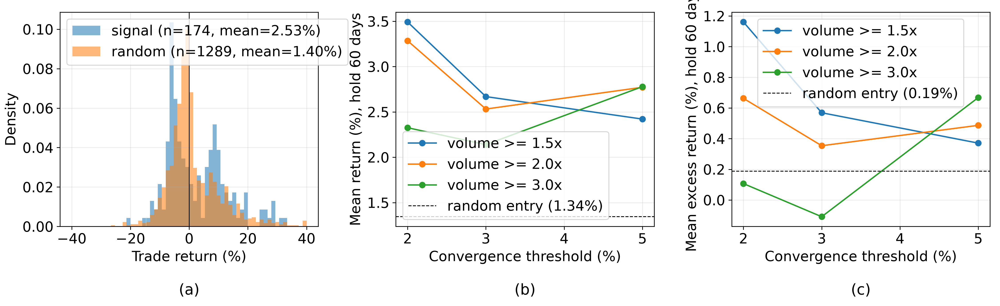
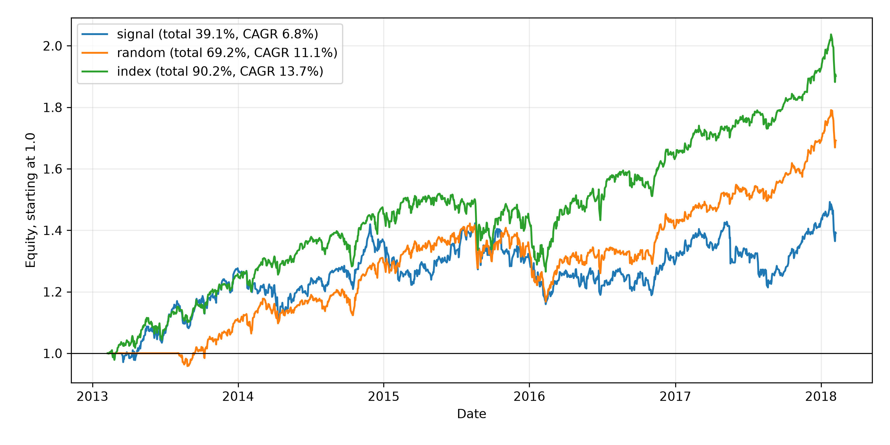

# Klomagi Moving Average Convergence Breakout
Rev. 3 | Created: 2026-09-10 | Updated: 2026-09-10 23:20 UTC

## 1. Purpose

- **Problem Statement**: 클로마기 기법은 차트 분석가들 사이에서 구전으로 전해져 조건이 사람마다 다르고, 실제로 통하는지 확인된 적이 없다.
- **Goal**: 기법의 매수·매도 조건을 재현 가능한 수치로 못 박고, 그 조건이 같은 종목에 무작위로 진입한 경우보다 나은지 실측으로 가린다.
- **Non-Goal**: 재료, 실적, 수급 같은 차트 밖 변수는 다루지 않는다. 공매도와 분할 매매도 다루지 않는다. 국내 시장 데이터로는 검증하지 않는다.

## 2. Summary

이 기법의 초과수익은 시장 상승분을 걷어내면 사실상 사라진다. 2013-02-08 ~ 2018-02-07 S&P 500 505종목에서 base 조건이 만든 매매는 174건, 한 건당 평균 +2.53%로 무작위 진입의 +1.40%를 앞섰다. 그러나 같은 날짜의 지수 수익을 뺀 초과수익은 +0.35% 대 +0.20% 로 차이가 +0.16%p 에 그쳤고 (Welch t=0.23), 표본을 606건으로 늘린 완화 조건에서도 차이는 +0.35%p (t=0.86) 였다. 원수익의 차이는 대부분 보유기간 차이 (42.5일 대 32.5일) 가 만든 시장 노출이다.

신호가 난 종목에 자본을 균등 배분해 5년을 굴리면 누적 +39.12%, 연환산 6.83% 다. 같은 기간 S&P 500 지수는 누적 +76.67%, 연환산 12.06% 이고 505종목 등가중 지수는 +90.18%, 13.73% 이므로, 기법은 지수를 사서 들고 있는 것보다 37.55%p 적게 벌었다. 최대 낙폭도 -18.50% 로 지수의 -14.16% 보다 깊다.

남는 것은 승률이다. 20일 보유 기준으로 신호 매매의 승률은 53~63%, 무작위 진입은 42~49% 로, 조사한 18개 조건 조합 모두에서 신호 쪽이 높았다. 즉 이 기법은 **이길 확률을 높이는 진입 조건이지 수익률을 높이는 기법이 아니다**. 수치의 근거는 [Appendix B](#appendix-b-backtest) 에 있다.

## 3. Principle

클로마기는 단기·중기·장기 이동평균선이 한 곳으로 응축된 뒤 거래량을 동반해 그 뭉치를 뚫는 구간을 잡는 기법이다. 이름은 차트에서 이평선이 Cross (교차) → Magic (반등) → Break (돌파) 로 이어지는 모양을 줄인 합성어이며, 금융공학의 공식 용어가 아니라 국내 차트 분석가들의 관용어다.

원리는 두 단계다. 첫째, 주가가 박스권이나 조정을 오래 거치면 5일·20일·60일·120일 이동평균선의 간격이 좁아진다. 이 응축은 매수와 매도가 같은 가격대에서 오래 맞부딪혀 방향이 정해지지 않은 상태이며, 기법은 이를 에너지가 쌓인 구간으로 본다. 둘째, 쌓인 힘은 한 방향으로 풀린다. 대량 거래량을 동반한 장대양봉이 이평선 뭉치를 한 번에 뚫으면 위로, 거래량 없이 흘러내리면 아래로 풀린다. 매수 근거는 이 갈림에서 위쪽이 확인된 시점이다.

응축의 정도는 이평선 뭉치의 상단과 하단이 벌어진 폭으로 잰다.

$$S_t = \frac{\max_i M_{i,t} - \min_i M_{i,t}}{\min_i M_{i,t}} \hspace{19em} (1)$$

여기서 $M_{i,t}$ 는 $t$ 일의 $i$ 일 이동평균이고 $i \in \{5, 20, 60, 120\}$ 이다. $S_t$ 가 작을수록 이평선이 밀집한 상태이며, 이 문서의 base 조건은 $S_t \le 0.03$ 을 응축으로 본다.

## 4. Application

매수는 응축·돌파·지지의 세 단계를 차례로 확인하고 들어간다.

1. **이동평균선의 극단적 수렴** — 단기·중기·장기 이평선의 간격이 좁아진 구간을 포착한다. 이 단계는 관찰일 뿐 매수 시점이 아니다.
2. **거래량 유입과 장대양봉 돌파** — 수렴된 뭉치를 대량 거래량을 동반한 장대양봉이 뚫고 올라간 날을 매수 타점으로 본다.
3. **지지 확인과 정배열 전환** — 돌파 후 눌림목에서 이평선의 지지를 받으며 단기-중기-장기 순서로 선이 펼쳐지는 초입을 확인한다.

Table 1. Rule conditions and the base values used in this document

| Step | Condition | Base value |
| --- | --- | --- |
| Convergence | 이평선 뭉치의 폭 $S_t$ | 0.03 이하 |
| Breakout | 종가가 뭉치 상단을 넘어선 첫날 | 전일 종가는 상단 이하 |
| Volume | 직전 20일 평균 거래량 대비 배수 | 2.0 배 이상 |
| Candle | 시가 대비 종가의 몸통 | 3% 이상 |
| Entry | 신호 다음 날 시가 | — |
| Stop | 신호일 이평선 뭉치 하단 | 종가가 하단을 깨면 다음 날 시가에 매도 |
| Holding limit | 손절에 걸리지 않을 때의 보유 한도 | 60 거래일 |

한계는 두 가지다. 첫째, **속임수 패턴**이다. 이평선이 밀집했다고 반드시 위로 터지지 않으며, 거래량이 따르지 않으면 역배열로 무너진다. 실측에서도 base 조건 매매의 45.4%가 손절로 끝났으므로, 밀집 이평선 하단이라는 손절선을 미리 정해 두지 않으면 이 기법은 성립하지 않는다. 둘째, **차트만으로는 모자란다**. 회사의 재료와 실적, 해당 섹터의 수급이 함께 뒷받침되는지 확인해야 하며, 이 문서의 실측은 차트 조건만 쓴 결과이므로 아래 Comparison 의 수치는 그 조건만의 성적이다.

## 5. Comparison

같은 종목·같은 매도 규칙에 진입일만 무작위로 바꾼 대조군과 비교하면, 신호가 앞서는 것은 승률뿐이다. 조사한 18개 조건 조합에서 신호 매매의 건당 평균 수익은 18개 모두 대조군보다 높았지만, 같은 기간 지수 수익을 뺀 초과수익 기준으로는 15개에서만 높았고 차이의 평균은 +0.24%p 였다. 왕복 거래비용 0.2%를 가정하면 base 조건의 초과수익 +0.35%는 +0.15%로 줄어, 대조군과 구별되지 않는다.

대조군을 두지 않으면 이 판단은 불가능하다. 2013-2018 표본에서 505종목의 단순 보유 수익은 평균 +92.97% (4.86년) 였고, 60 거래일로 환산하면 +4.55% 다. 건당 +2.53% 중 지수가 같은 날짜에 준 몫이 +2.18% 이므로, 대조군 없이 "평균 +2.5%" 만 보고하면 기법의 성적으로 읽히지만 실제로는 대부분 상승장의 몫이다.

## 6. Further Work

- **국내 시장 데이터로 재검증** — 이 문서의 표본은 S&P 500 이고, 기법은 국내 시장에서 쓰인다. 가격제한폭과 거래량 쏠림이 다르므로 돌파의 성질도 다르다. KRX 일별 OHLCV 와 상장폐지 종목을 포함한 종목 목록이 있어야 착수할 수 있다.
- **재료·수급 변수의 결합** — Application 이 필수라고 적은 재료와 수급이 실측에서는 빠져 있고, 남은 효과가 승률뿐이므로 걸러낼 변수가 필요하다. 공시 이력과 투자자별 매매동향을 날짜로 붙일 수 있는 데이터가 있어야 한다.
- **매도 규칙의 분리 검증** — 이 문서는 손절선과 60 거래일 한도를 고정한 채 진입만 비교했다. 초과수익이 보유기간에 따라 갈렸으므로, 진입 조건을 고정하고 매도 규칙만 바꾼 비교가 다음 차례다. 추가 데이터 없이 같은 표본으로 할 수 있다.

## References

<a id="ref-1"></a>
[1] Plotly. [S&P 500 daily prices, 2013-02-08 to 2018-02-07 (`all_stocks_5yr.csv`)](https://raw.githubusercontent.com/plotly/datasets/master/all_stocks_5yr.csv). plotly/datasets repository.<br>
<a id="ref-2"></a>
[2] Vega. [S&P 500 index daily prices since 2000 (`sp500-2000.csv`)](https://raw.githubusercontent.com/vega/vega-datasets/main/data/sp500-2000.csv). vega/vega-datasets repository.

---

## Appendix A. Terminology

- **band**: 5일·20일·60일·120일 이동평균 네 개가 이루는 띠. 상단은 넷 중 최대, 하단은 최소.
- **base 조건**: 이 문서가 기준으로 삼은 조건 한 벌. 수렴 3%, 거래량 2.0배, 몸통 3%, 보유 한도 60 거래일.
- **equal weight index**: 표본의 505종목을 매일 같은 비중으로 들고 있는 가상의 계좌. 하루 수익은 그날 값이 있는 모든 종목의 종가 수익률의 단순 평균이며, 그것을 곱해 쌓은 것이 지수 수준이다. 시가총액 가중인 S&P 500 지수와 다르다.
- **excess return**: 매매 수익에서 같은 진입일·청산일 사이 등가중 지수 수익을 뺀 값.
- **max drawdown**: 계좌 잔고가 그때까지의 최고점 대비 가장 크게 줄어든 폭.
- **profit factor**: 이익 매매 수익의 합을 손실 매매 손실의 합의 절댓값으로 나눈 값.
- **time in market**: 전체 거래일 중 매매를 하나라도 들고 있던 날의 비율.
- **Welch t**: 분산이 다른 두 집단의 평균 차이를 검정하는 t 통계량.
- **정배열**: 단기 이평선이 위, 장기 이평선이 아래에 차례로 놓인 상태.
- **장대양봉**: 시가보다 종가가 크게 높아 몸통이 긴 양봉.

## Appendix B. Backtest

### B.1 Data and method

표본은 S&P 500 505종목의 2013-02-08 ~ 2018-02-07 일별 OHLCV 619,029행이다 [[1](#ref-1)]. OHLCV 중 하나라도 빠진 11행은 버렸다. 종목별로 이동평균 네 개와 직전 20일 평균 거래량을 만들고, Table 1 의 조건을 모두 만족한 날을 신호로 삼아 다음 날 시가에 매수했다. 매도는 종가가 신호일 뭉치 하단 아래로 내려간 다음 날 시가, 또는 60 거래일 한도 다음 날 시가 중 먼저 오는 쪽이다. 한 종목에서 매매는 겹치지 않으며, 앞 매매가 끝난 뒤의 신호만 받는다.

S&P 500 지수는 같은 날짜의 일별 종가를 따로 읽어 썼다 [[2](#ref-2)]. 대조군은 같은 종목에서 신호 건수의 10배만큼 진입일을 균일 무작위로 뽑아 동일한 매도 규칙으로 청산한 매매다. 두 팔의 차이가 곧 진입 조건의 값이며, 시장 상승분은 양쪽에 똑같이 들어간다. 초과수익은 505종목 등가중 지수를 만들어 매매의 진입일과 청산일 사이 지수 수익을 뺀 값이다.

### B.2 Result of the base parameter set

Table 2. Per trade statistics of the base parameter set

| Metric | Signal | Random entry |
| --- | --- | --- |
| Trades | 174 | 1,289 |
| Win rate (%) | 48.85 | 43.37 |
| Mean return (%) | 2.532 | 1.399 |
| Median return (%) | -0.209 | -0.640 |
| Std of return (%) | 10.399 | 9.033 |
| Mean win (%) | 11.283 | 8.717 |
| Mean loss (%) | -5.827 | -4.205 |
| Profit factor | 1.849 | 1.587 |
| Mean holding (trading days) | 42.5 | 32.5 |
| Stop exits (%) | 45.4 | 56.9 |
| Mean excess return (%) | 0.354 | 0.195 |

두 팔의 평균 차이는 원수익 +1.13%p (Welch t=1.37), 초과수익 +0.16%p (t=0.23) 다. 신호는 141개 종목에서 나왔고 진입일은 2013-03-15 부터 2018-02-05 까지 퍼져 있다. 조건을 완화해 표본을 늘린 경우 (수렴 5%, 거래량 1.5배) 신호 606건, 대조군 4,059건에서 원수익 차이는 +1.35%p (t=2.88) 로 커지지만 초과수익 차이는 +0.35%p (t=0.86) 에 머문다. 표본을 3.5배로 늘려도 초과수익 쪽 t 값이 1을 넘지 않는다.

### B.3 Parameter sweep

Table 3. Mean return and win rate over the parameter grid, body >= 3%

| Convergence | Volume | Hold (days) | Signal trades | Signal return (%) | Random return (%) | Signal excess (%) | Random excess (%) | Signal win (%) | Random win (%) |
| --- | --- | --- | --- | --- | --- | --- | --- | --- | --- |
| 0.02 | 1.5 | 20 | 146 | 2.40 | 0.64 | 0.83 | 0.12 | 55.48 | 48.67 |
| 0.02 | 1.5 | 60 | 145 | 3.49 | 1.23 | 1.16 | 0.15 | 47.59 | 42.79 |
| 0.02 | 2.0 | 20 | 83 | 1.86 | 0.55 | 0.23 | -0.02 | 60.24 | 48.55 |
| 0.02 | 2.0 | 60 | 83 | 3.28 | 1.17 | 0.66 | 0.05 | 53.01 | 41.34 |
| 0.02 | 3.0 | 20 | 27 | 1.26 | 0.38 | -0.12 | -0.19 | 62.96 | 42.02 |
| 0.02 | 3.0 | 60 | 27 | 2.33 | 1.64 | 0.11 | 0.32 | 48.15 | 37.38 |
| 0.03 | 1.5 | 20 | 301 | 1.44 | 0.69 | 0.23 | 0.11 | 53.16 | 48.04 |
| 0.03 | 1.5 | 60 | 299 | 2.67 | 1.32 | 0.57 | 0.12 | 46.49 | 42.15 |
| 0.03 | 2.0 | 20 | 174 | 1.14 | 0.61 | -0.14 | -0.02 | 56.32 | 48.60 |
| 0.03 | 2.0 | 60 | 174 | 2.53 | 1.40 | 0.35 | 0.20 | 48.85 | 43.37 |
| 0.03 | 3.0 | 20 | 64 | 1.20 | 0.61 | 0.12 | -0.01 | 59.38 | 47.54 |
| 0.03 | 3.0 | 60 | 64 | 2.14 | 1.40 | -0.11 | 0.18 | 51.56 | 43.03 |
| 0.05 | 1.5 | 20 | 617 | 1.36 | 0.53 | 0.21 | -0.04 | 56.40 | 45.54 |
| 0.05 | 1.5 | 60 | 606 | 2.42 | 1.07 | 0.37 | 0.02 | 48.84 | 40.77 |
| 0.05 | 2.0 | 20 | 370 | 1.15 | 0.49 | -0.10 | -0.11 | 58.65 | 47.17 |
| 0.05 | 2.0 | 60 | 367 | 2.77 | 1.18 | 0.49 | 0.06 | 51.77 | 42.75 |
| 0.05 | 3.0 | 20 | 150 | 1.47 | 0.61 | 0.40 | 0.06 | 60.67 | 47.62 |
| 0.05 | 3.0 | 60 | 150 | 2.78 | 1.68 | 0.67 | 0.59 | 54.00 | 43.88 |

조건을 조일수록 매매 건수는 줄지만 (수렴 5%·거래량 1.5배의 617건에서 수렴 2%·거래량 3.0배의 27건) 건당 초과수익이 그만큼 좋아지지는 않는다. 승률만은 조건을 조일수록 높아져, 20일 보유에서 거래량 3.0배 조건의 승률은 59~63% 다.



Fig 1. Trade return distribution and parameter sweep. (a) density of trade returns for the base parameter set, (b) mean return per trade, (c) mean return net of the equal weight index.

Fig 1 (a) 에서 두 팔의 분포는 폭과 위치가 거의 같고, 신호 쪽이 오른쪽으로 조금 더 두껍다. (b) 의 원수익은 모든 조합에서 무작위 진입선 위에 있으나, (c) 의 초과수익에서는 선에 붙거나 아래로 내려가는 조합이 나온다. Summary 의 결론은 (b) 와 (c) 의 이 차이를 말한 것이다.

### B.4 Cumulative and annualized return

건당 수익을 자본의 성장으로 바꾸려면 매매를 한 계좌로 묶어야 한다. 이 문서는 그날 열려 있는 매매에 자본을 균등 배분하고, 열린 매매가 없는 날은 현금으로 두어 아무것도 벌지 않는 계좌를 가정한다. 매매는 진입일에 시가로 사서 종가까지, 그 뒤로는 종가에서 종가까지, 청산일에는 직전 종가에서 청산 가격까지의 수익을 낸다. 이 일별 수익을 곱해 쌓은 것이 아래의 누적 수익이고, 연환산은 표본 전체 거래일 1,259일을 252로 나눈 5.0년으로 환산한 값이다.

Table 4. Portfolio result of the base parameter set, 2013-02-08 to 2018-02-07

| Metric | Signal | Random entry | S&P 500 index | Equal weight index |
| --- | --- | --- | --- | --- |
| Cumulative return (%) | 39.12 | 69.19 | 76.67 | 90.18 |
| Annualized return (%) | 6.83 | 11.10 | 12.06 | 13.73 |
| Max drawdown (%) | -18.50 | -17.90 | -14.16 | -16.71 |
| Time in market (%) | 98.1 | 90.4 | 100.0 | 100.0 |
| Mean open positions | 6.0 | 34.3 | 1.0 | 1.0 |

신호 계좌는 S&P 500 지수보다 37.55%p, 등가중 지수보다 51.06%p 적게 벌면서 낙폭은 S&P 500 지수보다 4.34%p 더 깊었다. 원인은 건당 수익이 아니라 분산이다. 신호는 5년 동안 174건뿐이어서 하루 평균 6개 종목만 들고 있었고, 대조군은 같은 규칙으로 1,289건을 벌려 34.3개를 들고 있었다. 종목 수가 적으면 개별 종목의 손실이 계좌 전체를 흔들고 복리로 쌓는 과정에서 깎이는 몫이 커진다. 건당 평균의 우위 (+2.53% 대 +1.40%) 가 누적에서 유지되지 않은 결과가 Table 4 다.

두 지수는 만드는 방식이 다르다. S&P 500 은 시가총액 가중이고 편입·퇴출이 반영된 실제 지수인 반면, 등가중 지수는 표본이 담은 505종목을 매일 같은 비중으로 재조정한 것이다. 표본의 종목은 마지막 날 505개가 모두 살아 있지만 첫날에는 476개뿐이므로, 이 목록은 구간 끝에 남은 종목만 담은 셈이고 등가중 지수가 13.51%p 높은 데에는 그 편향이 들어 있다. 기법의 성적을 지수와 견줄 때 S&P 500 쪽을 기준으로 삼는 이유가 여기 있다. 둘 다 배당을 뺀 가격 지수이며, 계좌의 수익도 배당 없이 가격만으로 계산했다.

등가중 지수의 누적 +90.18% 는 Comparison 의 단순 보유 평균 +92.97% 와도 다르다. 앞의 값은 매일 재조정한 계좌의 복리 수익이고, 뒤의 값은 종목별 5년 총수익의 산술평균이다.



Fig 2. Equity of the signal portfolio, the random entry portfolio, the S&P 500 index and the equal weight index, all starting at 1.0.

Fig 2 에서 신호 계좌는 2015년 중반까지 두 지수와 함께 가다가 그 뒤로 벌어진다. 계좌가 현금으로 쉰 날은 전체의 1.9% 뿐이므로 격차는 쉰 시간이 아니라 종목 수에서 온다. 하루 평균 6개를 들고 있는 계좌는 그중 한 종목이 손절될 때마다 잔고의 1/6이 흔들리고, 그 자리를 다음 신호가 채울 때까지 상승분을 받지 못한다.

### B.5 Reproduction

```bash
python3 klomagi_backtest.py --data-csv all_stocks_5yr.csv --index-csv sp500-2000.csv \
    --output-folder klomagi_backtest_out
```

`--data-csv` 와 `--index-csv` 가 가리키는 파일이 없으면 References 의 주소에서 내려받는다. 출력은 매매 한 건이 한 행인 `trades.csv`, 조건 조합별 집계인 `grid.csv`, 네 계좌의 일별 수익과 보유 종목 수인 `equity.csv`, Fig 1 의 `fig1.png` 와 Fig 2 의 `fig2.png`, 그리고 표본과 조건과 집계를 담은 `summary.json` 이다. 대조군의 무작위 진입일은 `--seed` 로 고정되며, 이 문서의 수치는 기본값 20260910 으로 얻은 것이다.

## Appendix C. Backtest script

```python
# Stock/klomagi_backtest.py
__author__ = 'yRocket'
__version__ = "0.2.0.2026.9.10"  # Semantic Versioning: Major.Minor.Patch.Date(YYYY.M.D)

__all__ = [
    'RuleParams',
    'TradeColumn',
    'load_prices',
    'build_indicators',
    'build_market_index',
    'add_excess_return',
    'find_signals',
    'run_trades',
    'summarize',
    'equity_curve',
    'load_index_level',
    'index_curve',
    'portfolio_stats',
    'run_grid',
    'plot_results',
    'plot_equity',
]

import argparse
import enum
import json
import pathlib
import sys
import urllib.request
from dataclasses import dataclass, asdict

import matplotlib
import numpy as np
import pandas as pd
from tqdm import tqdm

matplotlib.use('Agg')
import matplotlib.pyplot as plt  # noqa: E402  matplotlib requires the backend to be set before pyplot

DATA_URL: str = 'https://raw.githubusercontent.com/plotly/datasets/master/all_stocks_5yr.csv'
INDEX_URL: str = 'https://raw.githubusercontent.com/vega/vega-datasets/main/data/sp500-2000.csv'
MA_WINDOWS: tuple = (5, 20, 60, 120)
VOLUME_WINDOW: int = 20
CONTROL_DRAWS_PER_SIGNAL: int = 10   # the control is oversampled so its mean is the tighter of the two
FIGSIZE: tuple = (15.0, 4.6)
EQUITY_FIGSIZE: tuple = (10.0, 5.0)
REFERENCE_WIDTH: float = 9.0     # the width BASE_FONT_SIZE was chosen for
BASE_FONT_SIZE: float = 9.0
TRADING_DAYS_PER_YEAR: int = 252


class TradeColumn(enum.StrEnum):
    """Column names of the trade table, used by both the trade runner and the plots."""

    TICKER = enum.auto()
    ENTRY_DATE = enum.auto()
    EXIT_DATE = enum.auto()
    ENTRY_PRICE = enum.auto()
    EXIT_PRICE = enum.auto()
    HOLD_DAYS = enum.auto()
    RETURN_PCT = enum.auto()
    EXCESS_PCT = enum.auto()
    EXIT_REASON = enum.auto()
    ARM = enum.auto()


class ExitReason(enum.StrEnum):
    """Why a position was closed."""

    STOP = enum.auto()
    HOLD_LIMIT = enum.auto()
    DATA_END = enum.auto()


class Arm(enum.StrEnum):
    """Which entry rule produced the trade."""

    SIGNAL = enum.auto()
    RANDOM = enum.auto()


@dataclass(frozen=True)
class RuleParams:
    """One parameter set of the klomagi rule.

    conv_max: highest allowed (band_high - band_low) / band_low on the breakout day.
    vol_mult: lowest allowed volume as a multiple of the trailing VOLUME_WINDOW mean volume.
    body_min: lowest allowed (close - open) / open of the breakout candle.
    hold_days: number of trading days a position is held when the stop is not touched.
    """

    conv_max: float = 0.03
    vol_mult: float = 2.0
    body_min: float = 0.03
    hold_days: int = 60


def load_prices(csv_path: pathlib.Path, url: str = DATA_URL) -> pd.DataFrame:
    """Read the daily OHLCV table, downloading it once when the file is absent.

    Returns a pd.DataFrame with a RangeIndex and columns
    ['date', 'open', 'high', 'low', 'close', 'volume', 'ticker'], sorted by ticker then date.
    """
    if not csv_path.exists():
        csv_path.parent.mkdir(parents=True, exist_ok=True)
        print(f"downloading {url} -> {csv_path}", flush=True)
        urllib.request.urlretrieve(url, csv_path)

    frame = pd.read_csv(csv_path, parse_dates=['date'])
    expected = {'date', 'open', 'high', 'low', 'close', 'volume', 'Name'}
    missing = expected - set(frame.columns)
    if missing:
        raise ValueError(f"{csv_path} lacks columns {sorted(missing)}; got {sorted(frame.columns)}")

    frame = frame.rename(columns={'Name': 'ticker'})
    dropped = frame[['open', 'high', 'low', 'close', 'volume']].isna().any(axis=1).sum()
    if dropped:
        print(f"dropping {dropped} rows with missing OHLCV out of {len(frame)}", flush=True)
    frame = frame.dropna(subset=['open', 'high', 'low', 'close', 'volume'])
    return frame.sort_values(['ticker', 'date']).reset_index(drop=True)


def build_indicators(prices: pd.DataFrame) -> pd.DataFrame:
    """Add the moving average bundle and the trailing volume mean of one ticker.

    Returns a pd.DataFrame with a RangeIndex and the columns of the input plus
    ['band_high', 'band_low', 'spread', 'vol_mean', 'body'].
    """
    frame = prices.reset_index(drop=True).copy()
    bundle = pd.DataFrame({f"ma{w}": frame['close'].rolling(window=w).mean() for w in MA_WINDOWS})
    frame['band_high'] = bundle.max(axis=1)
    frame['band_low'] = bundle.min(axis=1)
    frame['spread'] = (frame['band_high'] - frame['band_low']) / frame['band_low']
    frame['vol_mean'] = frame['volume'].shift(1).rolling(window=VOLUME_WINDOW).mean()
    frame['body'] = (frame['close'] - frame['open']) / frame['open']
    return frame


def build_market_index(prices: pd.DataFrame) -> pd.Series:
    """Build the equal weight index of the universe.

    Returns a pd.Series named 'index_level' indexed by 'date', starting at 1.0 on the first date.
    """
    daily = prices.pivot_table(index='date', columns='ticker', values='close').sort_index()
    mean_return = daily.pct_change().mean(axis=1).fillna(0.0)
    level = (1.0 + mean_return).cumprod()
    level.name = 'index_level'
    return level


def add_excess_return(trades: pd.DataFrame, index_level: pd.Series) -> pd.DataFrame:
    """Add the return of each trade net of the equal weight index over the same dates.

    Returns the input pd.DataFrame plus the column TradeColumn.EXCESS_PCT.
    """
    entry_level = index_level.reindex(pd.to_datetime(trades[TradeColumn.ENTRY_DATE])).to_numpy()
    exit_level = index_level.reindex(pd.to_datetime(trades[TradeColumn.EXIT_DATE])).to_numpy()
    if np.isnan(entry_level).any() or np.isnan(exit_level).any():
        raise ValueError("a trade date is missing from the index; the index and the trades disagree on dates")
    market = 100.0 * (exit_level / entry_level - 1.0)
    frame = trades.copy()
    frame[TradeColumn.EXCESS_PCT] = frame[TradeColumn.RETURN_PCT] - market
    return frame


def find_signals(indicators: pd.DataFrame, params: RuleParams) -> np.ndarray:
    """Return the integer positions of the breakout days of one ticker."""
    close = indicators['close']
    band_high = indicators['band_high']
    converged = indicators['spread'] <= params.conv_max
    broke_out = (close > band_high) & (close.shift(1) <= band_high.shift(1))
    heavy = indicators['volume'] >= params.vol_mult * indicators['vol_mean']
    wide = indicators['body'] >= params.body_min
    hit = converged & broke_out & heavy & wide
    return np.flatnonzero(hit.to_numpy(dtype=bool))


def _close_position(indicators: pd.DataFrame, entry_pos: int, params: RuleParams) -> tuple:
    """Walk one position forward and return (exit_pos, exit_price, reason).

    The stop is the bundle floor of the breakout day; it is checked on closes and filled at the
    next open, which is the earliest price a close based rule can actually trade at.
    """
    close = indicators['close'].to_numpy()
    open_ = indicators['open'].to_numpy()
    stop_level = indicators['band_low'].to_numpy()[entry_pos - 1]
    last_pos = len(close) - 1

    for pos in range(entry_pos, min(entry_pos + params.hold_days, last_pos) + 1):
        if close[pos] < stop_level:
            if pos == last_pos:
                return pos, close[pos], ExitReason.DATA_END
            return pos + 1, open_[pos + 1], ExitReason.STOP

    limit_pos = entry_pos + params.hold_days
    if limit_pos >= last_pos:
        return last_pos, close[last_pos], ExitReason.DATA_END
    return limit_pos + 1, open_[limit_pos + 1], ExitReason.HOLD_LIMIT


def _walk_entries(indicators: pd.DataFrame, entry_positions: np.ndarray, params: RuleParams,
                  ticker: str, arm: Arm) -> list:
    """Turn entry positions into non overlapping trades of one ticker."""
    dates = indicators['date'].to_numpy()
    open_ = indicators['open'].to_numpy()
    trades: list = []
    busy_until = -1

    for pos in entry_positions:
        entry_pos = pos + 1                          # the signal is only tradable at the next open
        if entry_pos <= busy_until or entry_pos >= len(open_):
            continue
        exit_pos, exit_price, reason = _close_position(indicators=indicators, entry_pos=entry_pos, params=params)
        entry_price = open_[entry_pos]
        trades.append({
            TradeColumn.TICKER: ticker,
            TradeColumn.ENTRY_DATE: dates[entry_pos],
            TradeColumn.EXIT_DATE: dates[exit_pos],
            TradeColumn.ENTRY_PRICE: entry_price,
            TradeColumn.EXIT_PRICE: exit_price,
            TradeColumn.HOLD_DAYS: int(exit_pos - entry_pos),
            TradeColumn.RETURN_PCT: 100.0 * (exit_price / entry_price - 1.0),
            TradeColumn.EXIT_REASON: str(reason),
            TradeColumn.ARM: str(arm),
        })
        busy_until = exit_pos

    return trades


def run_trades(prices: pd.DataFrame, params: RuleParams, seed: int = 20260910,
               progress: bool = True) -> pd.DataFrame:
    """Run the signal arm and the random control arm over every ticker.

    The control draws, per ticker, CONTROL_DRAWS_PER_SIGNAL entry days per signal, uniformly from
    the days where the bundle is defined, and closes them with the identical exit rule.

    Returns a pd.DataFrame with a RangeIndex and the columns of TradeColumn.
    """
    rng = np.random.default_rng(seed)
    warmup = max(MA_WINDOWS)
    groups = prices.groupby('ticker', sort=True)
    bar = tqdm(groups, ncols=100, unit='ticker', disable=not progress)
    trades: list = []

    for ticker, frame in bar:
        bar.set_description(f"Scanning {ticker}")
        if len(frame) <= warmup + 2:
            continue
        indicators = build_indicators(prices=frame)
        signal_positions = find_signals(indicators=indicators, params=params)
        trades.extend(_walk_entries(indicators=indicators, entry_positions=signal_positions,
                                    params=params, ticker=ticker, arm=Arm.SIGNAL))
        if len(signal_positions) == 0:
            continue
        pool = np.arange(warmup, len(indicators) - 1)
        draws = min(CONTROL_DRAWS_PER_SIGNAL * len(signal_positions), len(pool))
        drawn = np.sort(rng.choice(pool, size=draws, replace=False))
        trades.extend(_walk_entries(indicators=indicators, entry_positions=drawn,
                                    params=params, ticker=ticker, arm=Arm.RANDOM))

    if not trades:
        raise ValueError(f"no trade was produced by {params}; loosen the thresholds or check the data")
    return pd.DataFrame(trades)


def summarize(trades: pd.DataFrame) -> dict:
    """Reduce one arm of trades to the reported statistics."""
    returns = trades[TradeColumn.RETURN_PCT].to_numpy(dtype=float)
    wins = returns[returns > 0.0]
    losses = returns[returns <= 0.0]
    hold = trades[TradeColumn.HOLD_DAYS].to_numpy(dtype=float)
    stderr = returns.std(ddof=1) / np.sqrt(len(returns)) if len(returns) > 1 else np.nan
    profit_factor = wins.sum() / abs(losses.sum()) if losses.sum() != 0.0 else np.inf
    return {
        'trades': int(len(returns)),
        'win_rate_pct': round(100.0 * len(wins) / len(returns), 2),
        'mean_return_pct': round(float(returns.mean()), 3),
        'median_return_pct': round(float(np.median(returns)), 3),
        'std_return_pct': round(float(returns.std(ddof=1)), 3),
        'mean_win_pct': round(float(wins.mean()), 3) if len(wins) else np.nan,
        'mean_loss_pct': round(float(losses.mean()), 3) if len(losses) else np.nan,
        'profit_factor': round(float(profit_factor), 3),
        'mean_hold_days': round(float(hold.mean()), 1),
        'mean_excess_pct': round(float(trades[TradeColumn.EXCESS_PCT].mean()), 3),
        't_stat': round(float(returns.mean() / stderr), 2) if np.isfinite(stderr) else np.nan,
        'stop_exit_pct': round(100.0 * float((trades[TradeColumn.EXIT_REASON] == ExitReason.STOP).mean()), 1),
    }


def equity_curve(prices: pd.DataFrame, trades: pd.DataFrame) -> pd.DataFrame:
    """Turn one arm of trades into the daily curve of a portfolio that splits capital evenly.

    On a given day the capital is spread over the positions open that day and sits in cash, earning
    nothing, on the days with no position. A position earns close/open on its entry day, close on
    close while it is held, and the recorded exit price against the previous close on its exit day.

    Returns a pd.DataFrame indexed by 'date' with the columns
    ['daily_return', 'open_positions', 'equity'], where equity starts at 1.0 before the first day.
    """
    calendar = np.sort(prices['date'].unique())
    series = {ticker: (frame['date'].to_numpy(), frame['open'].to_numpy(), frame['close'].to_numpy())
              for ticker, frame in prices.groupby('ticker', sort=False)}
    total = np.zeros(len(calendar))
    count = np.zeros(len(calendar))

    for row in trades.itertuples(index=False):
        ticker = getattr(row, TradeColumn.TICKER)
        if ticker not in series:
            raise ValueError(f"trade on {ticker} has no price series; the trades and the prices disagree")
        dates, open_, close = series[ticker]
        entry_pos = int(np.searchsorted(dates, np.datetime64(getattr(row, TradeColumn.ENTRY_DATE))))
        exit_pos = int(np.searchsorted(dates, np.datetime64(getattr(row, TradeColumn.EXIT_DATE))))
        exit_price = float(getattr(row, TradeColumn.EXIT_PRICE))

        returns = np.empty(exit_pos - entry_pos + 1)
        if exit_pos == entry_pos:
            returns[0] = exit_price / open_[entry_pos] - 1.0
        else:
            returns[0] = close[entry_pos] / open_[entry_pos] - 1.0
            held = np.arange(entry_pos + 1, exit_pos)
            returns[1:-1] = close[held] / close[held - 1] - 1.0
            returns[-1] = exit_price / close[exit_pos - 1] - 1.0

        slots = np.searchsorted(calendar, dates[entry_pos:exit_pos + 1])
        total[slots] += returns
        count[slots] += 1.0

    daily = np.where(count > 0.0, total / np.where(count > 0.0, count, 1.0), 0.0)
    curve = pd.DataFrame({'daily_return': daily, 'open_positions': count.astype(int),
                          'equity': (1.0 + daily).cumprod()}, index=pd.Index(calendar, name='date'))
    return curve


def load_index_level(csv_path: pathlib.Path, calendar: np.ndarray, url: str = INDEX_URL) -> pd.Series:
    """Read a daily index csv and return its close on exactly the given calendar.

    A calendar day the file does not cover is an error rather than a gap, because a curve drawn
    over a partial index would still look like a full comparison.

    Returns a pd.Series named 'index_level' indexed by 'date'.
    """
    if not csv_path.exists():
        csv_path.parent.mkdir(parents=True, exist_ok=True)
        print(f"downloading {url} -> {csv_path}", flush=True)
        urllib.request.urlretrieve(url, csv_path)

    frame = pd.read_csv(csv_path, parse_dates=['date'])
    missing = {'date', 'close'} - set(frame.columns)
    if missing:
        raise ValueError(f"{csv_path} lacks columns {sorted(missing)}; got {sorted(frame.columns)}")

    level = frame.set_index('date')['close'].sort_index().reindex(pd.Index(calendar, name='date'))
    absent = level[level.isna()]
    if not absent.empty:
        raise ValueError(f"{csv_path} misses {len(absent)} of the {len(calendar)} sample days, "
                         f"first {absent.index[0].date()}; the index does not cover the sample")
    level.name = 'index_level'
    return level


def index_curve(index_level: pd.Series) -> pd.DataFrame:
    """Cast the equal weight index into the same shape as an equity curve, so both are read alike.

    Returns a pd.DataFrame indexed by 'date' with the columns
    ['daily_return', 'open_positions', 'equity'].
    """
    daily = index_level.pct_change().fillna(0.0)
    return pd.DataFrame({'daily_return': daily.to_numpy(),
                         'open_positions': np.ones(len(daily), dtype=int),
                         'equity': (1.0 + daily).cumprod().to_numpy()},
                        index=pd.Index(index_level.index, name='date'))


def portfolio_stats(curve: pd.DataFrame) -> dict:
    """Reduce one equity curve to its cumulative return, annualized return and drawdown."""
    equity = curve['equity'].to_numpy()
    years = len(equity) / TRADING_DAYS_PER_YEAR
    drawdown = equity / np.maximum.accumulate(equity) - 1.0
    return {
        'days': int(len(equity)),
        'years': round(float(years), 2),
        'total_return_pct': round(100.0 * float(equity[-1] - 1.0), 2),
        'cagr_pct': round(100.0 * float(equity[-1] ** (1.0 / years) - 1.0), 2),
        'max_drawdown_pct': round(100.0 * float(drawdown.min()), 2),
        'time_in_market_pct': round(100.0 * float((curve['open_positions'] > 0).mean()), 1),
        'mean_open_positions': round(float(curve['open_positions'].mean()), 1),
    }


def buy_and_hold(prices: pd.DataFrame) -> dict:
    """Return the equal weight buy and hold statistics of the universe over the whole sample."""
    first = prices.groupby('ticker')['close'].first()
    last = prices.groupby('ticker')['close'].last()
    span = prices.groupby('ticker')['date'].size()
    total = 100.0 * (last / first - 1.0)
    years = float(span.mean()) / TRADING_DAYS_PER_YEAR
    return {
        'tickers': int(len(total)),
        'mean_total_return_pct': round(float(total.mean()), 2),
        'median_total_return_pct': round(float(total.median()), 2),
        'years': round(years, 2),
        'mean_return_per_60_days_pct': round(float(total.mean()) * 60.0 / (years * TRADING_DAYS_PER_YEAR), 3),
    }


def run_grid(prices: pd.DataFrame, conv_values: list, vol_values: list, hold_values: list,
             body_min: float, seed: int) -> pd.DataFrame:
    """Run the rule over a parameter grid.

    Returns a pd.DataFrame with a RangeIndex and the columns
    ['conv_max', 'vol_mult', 'hold_days', 'arm'] plus every key of summarize().
    """
    rows: list = []
    index_level = build_market_index(prices=prices)
    combos = [(c, v, h) for c in conv_values for v in vol_values for h in hold_values]
    bar = tqdm(combos, ncols=100, unit='combo')

    for conv_max, vol_mult, hold_days in bar:
        bar.set_description(f"conv={conv_max} vol={vol_mult} hold={hold_days}")
        params = RuleParams(conv_max=conv_max, vol_mult=vol_mult, body_min=body_min, hold_days=hold_days)
        trades = run_trades(prices=prices, params=params, seed=seed, progress=False)
        trades = add_excess_return(trades=trades, index_level=index_level)
        for arm in (Arm.SIGNAL, Arm.RANDOM):
            arm_trades = trades[trades[TradeColumn.ARM] == arm]
            if arm_trades.empty:
                continue
            rows.append({'conv_max': conv_max, 'vol_mult': vol_mult, 'hold_days': hold_days,
                         'arm': str(arm), **summarize(trades=arm_trades)})

    return pd.DataFrame(rows)


def plot_results(trades: pd.DataFrame, grid: pd.DataFrame, base_hold: int, fig_path: pathlib.Path) -> None:
    """Draw the trade return distribution and the two parameter sweeps into one three panel figure."""
    font_size = BASE_FONT_SIZE * FIGSIZE[0] / REFERENCE_WIDTH
    colors = list(matplotlib.colors.TABLEAU_COLORS.values())
    fig, axes = plt.subplots(nrows=1, ncols=3, figsize=FIGSIZE)

    bins = np.linspace(-40.0, 40.0, 61)
    for index, arm in enumerate((Arm.SIGNAL, Arm.RANDOM)):
        values = trades.loc[trades[TradeColumn.ARM] == arm, TradeColumn.RETURN_PCT].to_numpy(dtype=float)
        axes[0].hist(np.clip(values, bins[0], bins[-1]), bins=bins, density=True, alpha=0.55,
                     color=colors[index], label=f"{arm} (n={len(values)}, mean={values.mean():.2f}%)")
    axes[0].axvline(0.0, color='black', linewidth=0.8)
    axes[0].set_xlabel('Trade return (%)', fontsize=font_size)
    axes[0].set_ylabel('Density', fontsize=font_size)
    axes[0].legend(fontsize=font_size, loc='upper left')

    sweep = grid[(grid['arm'] == str(Arm.SIGNAL)) & (grid['hold_days'] == base_hold)]
    control = grid[(grid['arm'] == str(Arm.RANDOM)) & (grid['hold_days'] == base_hold)]
    panels = ((axes[1], 'mean_return_pct', 'Mean return (%)'),
              (axes[2], 'mean_excess_pct', 'Mean excess return (%)'))

    for axis, column, ylabel in panels:
        for index, vol_mult in enumerate(sorted(sweep['vol_mult'].unique())):
            line = sweep[sweep['vol_mult'] == vol_mult].sort_values('conv_max')
            axis.plot(100.0 * line['conv_max'], line[column], marker='o', color=colors[index],
                      label=f"volume >= {vol_mult}x")
        axis.axhline(control[column].mean(), color='black', linestyle='--', linewidth=0.9,
                     label=f"random entry ({control[column].mean():.2f}%)")
        axis.set_xlabel('Convergence threshold (%)', fontsize=font_size)
        axis.set_ylabel(f"{ylabel}, hold {base_hold} days", fontsize=font_size)
        axis.legend(fontsize=font_size, loc='best')

    for axis in axes:
        axis.tick_params(labelsize=font_size)
        axis.grid(alpha=0.25)

    fig.subplots_adjust(left=0.06, right=0.99, bottom=0.26, top=0.96, wspace=0.30)
    for axis, label in zip(axes, ('(a)', '(b)', '(c)')):
        box = axis.get_position()
        fig.text(box.x0 + box.width / 2.0, 0.05, label, ha='center', va='center', fontsize=font_size + 1)

    fig_path.parent.mkdir(parents=True, exist_ok=True)
    fig.savefig(fig_path, dpi=300)
    plt.close(fig)


def plot_equity(curves: dict, fig_path: pathlib.Path) -> None:
    """Draw the equity of every named curve on one axis, each labelled with its annualized return."""
    font_size = BASE_FONT_SIZE * EQUITY_FIGSIZE[0] / REFERENCE_WIDTH
    colors = list(matplotlib.colors.TABLEAU_COLORS.values())
    fig, axis = plt.subplots(nrows=1, ncols=1, figsize=EQUITY_FIGSIZE)

    for index, (name, curve) in enumerate(curves.items()):
        stats = portfolio_stats(curve=curve)
        axis.plot(curve.index, curve['equity'], color=colors[index],
                  label=f"{name} (total {stats['total_return_pct']:.1f}%, CAGR {stats['cagr_pct']:.1f}%)")

    axis.axhline(1.0, color='black', linewidth=0.8)
    axis.set_xlabel('Date', fontsize=font_size)
    axis.set_ylabel('Equity, starting at 1.0', fontsize=font_size)
    axis.tick_params(labelsize=font_size)
    axis.grid(alpha=0.25)
    axis.legend(fontsize=font_size, loc='upper left')

    fig.subplots_adjust(left=0.08, right=0.98, bottom=0.14, top=0.96)
    fig_path.parent.mkdir(parents=True, exist_ok=True)
    fig.savefig(fig_path, dpi=300)
    plt.close(fig)


def parse_args() -> argparse.Namespace:
    """Parse the command line options."""
    parser = argparse.ArgumentParser(
        prog=pathlib.Path(__file__).name,
        description=f"{pathlib.Path(__file__).name} {__version__}\n"
                    f"Backtest the klomagi moving average convergence breakout rule.",
        formatter_class=argparse.RawTextHelpFormatter)
    parser.add_argument('-v', '--version', action='version', version=f"{pathlib.Path(__file__).name} {__version__}")
    parser.add_argument('--data-csv', type=str, required=True,
                        help="daily OHLCV csv; downloaded from the public dataset when absent")
    parser.add_argument('--index-csv', type=str, required=True,
                        help="daily S&P 500 index csv; downloaded from the public dataset when absent")
    parser.add_argument('--output-folder', type=str, required=True,
                        help="root folder of every output file")
    parser.add_argument('--conv-max', type=float, default=0.03,
                        help="base convergence threshold of the moving average bundle")
    parser.add_argument('--vol-mult', type=float, default=2.0,
                        help="base volume multiple of the trailing mean volume")
    parser.add_argument('--body-min', type=float, default=0.03,
                        help="base minimum body of the breakout candle")
    parser.add_argument('--hold-days', type=int, default=60,
                        help="base holding limit in trading days")
    parser.add_argument('--grid', choices=['true', 'false'], default='true',
                        help="also run the parameter sweep")
    parser.add_argument('--seed', type=int, default=20260910,
                        help="seed of the random entry control")

    if len(sys.argv) == 1:
        parser.print_help()
        sys.exit(0)

    args = parser.parse_args()
    args.data_csv = pathlib.Path(args.data_csv)
    args.index_csv = pathlib.Path(args.index_csv)
    args.output_folder = pathlib.Path(args.output_folder)
    args.grid = args.grid == 'true'
    if args.hold_days < 1:
        parser.error(f"--hold-days must be positive; got {args.hold_days}")
    if not 0.0 < args.conv_max < 1.0:
        parser.error(f"--conv-max must lie in (0, 1); got {args.conv_max}")
    return args
```
