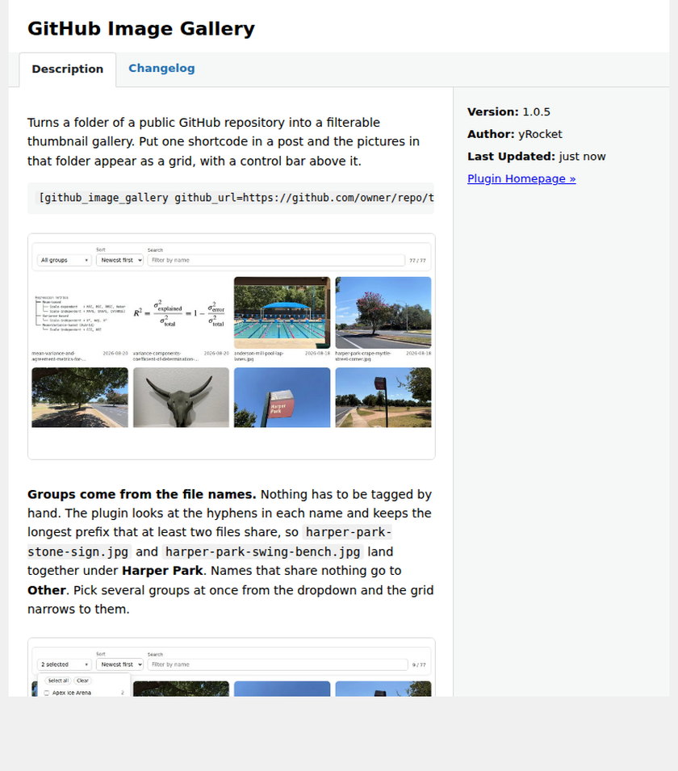

# GitHub Image Gallery

GitHub 공개 저장소의 이미지 폴더를 워드프레스 글에 thumbnail gallery로 넣는 플러그인.



설치하면 위와 같이 보인다. 설명과 스크린샷, 변경 이력이 모두 저장소에서 온다.

```
[github_image_gallery github_url=https://github.com/ykim2718/WordPress/tree/main/Images]
```

## 폴더 구조

플러그인 하나가 폴더 하나를 쓴다. 새 플러그인을 만들면 `plugins/` 아래에 같은 모양으로
폴더를 하나 더 두면 된다.

```
plugins/github-image-gallery/
├── src/                     ← 이 폴더만 zip으로 묶인다
│   ├── github-image-gallery.php
│   ├── includes/
│   └── assets/
├── dist/                    ← 빌드 결과. 워드프레스가 여기서 받는다
│   ├── github-image-gallery.zip
│   └── version.json
├── screenshots/             ← View details 창과 이 문서에 쓰는 그림
├── DESCRIPTION.md           ← View details 의 Description 탭
├── CHANGELOG.md             ← View details 의 Changelog 탭
└── README.md
```

`src/` 밖의 것은 zip에 들어가지 않으므로, 문서와 그림이 늘어나도 플러그인 용량은 그대로다.

## 어떻게 도는가

| 층 | 언어 | 하는 일 |
|---|---|---|
| 빌드 | Python (GitHub Actions) | `Images/`를 훑어 `index.json`과 썸네일, 플러그인 zip 생성 |
| 서버 | PHP | 정적 파일을 한 번 받아 캐시, group 계산, HTML 출력 |
| 화면 | JavaScript | group 다중 선택, 정렬, 검색, 라이트박스, 오른쪽 클릭 메뉴 |

이미지 목록은 두 경로로 읽는다.

1. **`index.json`** — `tools/build_image_index.py`가 CI에서 만들어 둔 것. `raw.githubusercontent.com`에서
   파일 하나만 받으면 되므로 **API 한도를 쓰지 않고**, commit 날짜·가로세로·썸네일 경로가 이미 들어 있다.
2. **contents API** — `index.json`이 없을 때의 대비책. 시간당 60회 한도를 쓰고, 날짜 정렬과
   썸네일 축소가 꺼진다. 이 경우 관리자에게만 안내 문구가 보인다.

목록은 `cache` 분 동안 transient에 담아 둔다. 제어줄의 **Refresh** 단추는 그 transient를
버리고 GitHub에서 다시 읽는다. 주소에 nonce가 붙어 있고, nonce가 지났으면 캐시를 그대로
쓴 채 그 사실을 화면에 적는다.

캐시는 세 겹이다. 위의 transient, WordPress의 page cache, 그리고 `raw.githubusercontent.com`이
`index.json`에 거는 5분짜리 CDN 캐시다. Refresh는 앞의 둘을 버리지만 — 요청을 캐시 대상에서
빼고, 눌린 시각을 주소에 실어 보내고, 그 글의 page cache를 지운다 — 마지막 하나는 어쩌지
못한다. 그래서 GitHub에 방금 올린 그림은 최대 5분 뒤에 나타난다.

## group 자동 생성

파일명을 하이픈으로 끊어 `min_group`개 이상 모이는 **가장 긴 prefix**를 group으로 잡는다.
여기에 두 가지 보정이 붙는다.

- 더 긴 prefix에 식구를 빼앗겨 혼자 남은 group은 `Other`로 보낸다.
- group 이름을 식구들의 공통 부분까지 늘린다. `apex-ice` → `apex-ice-arena`.

`group_depth=2` 기준으로 현재 폴더는 이렇게 나뉜다.

```
Apex Ice Arena 2   Harper Park 6   Prairie 2        Red 2
Apex Park 3        Heb 2           Prairie Road 2   White 2
Georgetown Resort Pool 2           Pumpjacks 2      Zernike Pyramid Noll 2
Lawn Worms Eye 3   Margaret Hunt Hill Bridge 2      Other 43
```

## 속성

| 속성 | 기본값 | 설명 |
|---|---|---|
| `github_url` | — | 필수. `tree`/`blob` URL 또는 `owner/repo/path` |
| `column` | 4 | 최대 열 수. 좁은 화면에서 자동으로 줄어든다 |
| `gap` | 14 | 타일 간격 px |
| `ratio` | `4/3` | 타일 비율. `auto`면 그림의 실제 비율을 쓴다 |
| `group_depth` | 2 | group으로 삼을 하이픈 마디 수의 최대값 |
| `min_group` | 2 | 이 개수 이상 모여야 group으로 인정 |
| `groups` | `''` | 처음부터 선택해 둘 group slug, 쉼표 구분 |
| `sort` | `date_desc` | `name_asc` \| `name_desc` \| `date_desc` \| `date_asc`. 날짜가 없는 목록이면 `name_asc` |
| `sort_by_date` | 0 | 1이면 날짜 최신순으로 시작 |
| `show_date` | 0 | caption에 commit 날짜 표시 |
| `show_name` | 1 | caption에 파일명 표시 |
| `show_search` | 1 | 검색 입력칸 표시 |
| `show_refresh` | 1 | Refresh 단추 표시 |
| `lightbox` | 1 | 클릭 시 overlay. 0이면 새 탭 |
| `context_menu` | 1 | 0이면 브라우저 기본 오른쪽 메뉴로 되돌린다 |
| `limit` | 0 | 0이면 전부 |
| `cache` | 60 | 목록 캐시 분 |

## 설치

1. 플러그인 화면 → 새로 추가 → 플러그인 업로드에 `dist/github-image-gallery.zip`.
2. 이후 업데이트는 플러그인 화면에 알림으로 뜬다.

비공개 저장소를 읽거나 API 한도를 5000회로 올리려면 `wp-config.php`에 토큰을 둔다.
`index.json` 경로만 쓴다면 없어도 된다.

```php
define('GITHUB_GALLERY_TOKEN', 'ghp_...');
```

## 새 버전 내보내기

`src/github-image-gallery.php`의 `Version:`과 `GIG_VERSION`을 올리고, `CHANGELOG.md` 맨 위에
항목을 적어서 push하면 끝이다. CI가 `dist/`를 다시 만들고 워드프레스에 업데이트가 뜬다.
tag도 release도 쓰지 않는다.

손으로 만들려면:

```bash
python3 tools/build_plugin_dist.py
```

## 썸네일 다시 만들기

`Images/`에 그림을 넣고 push하면 CI가 알아서 한다. 손으로 돌리려면:

```bash
pip install pillow
python3 tools/build_image_index.py            # --dir, --width, --quality
```

바뀌지 않은 그림의 썸네일은 sha1로 걸러 다시 만들지 않는다.

## 워크플로

`tools/workflows/image-index.yml`을 `.github/workflows/`에 넣으면 위의 두 가지가 자동으로 돈다.
이 세션의 토큰에 workflow 권한이 없어 대신 넣어 두지 못했다.
