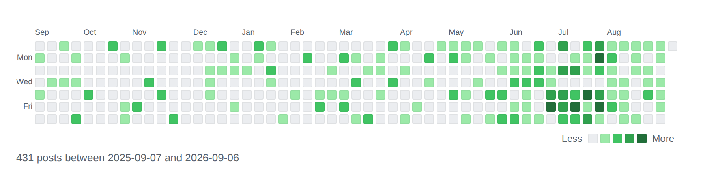

# Green Grass

하루를 칸 하나로 두고 그 날 몇 건이었는지를 칸의 짙기로 그리는 플러그인.
GitHub 프로필의 그 잔디다.



```
[green_grass]
[green_grass orientation="vertical" from="2026-01-01" to="2026-06-30"]
[green_grass source="github" user="ykim2718"]
```

## 폴더 구조

```
plugins/green-grass/
├── src/                     ← 이 폴더만 zip으로 묶인다
│   ├── green-grass.php
│   ├── includes/
│   ├── blocks/green-grass/
│   └── assets/
├── dist/                    ← 빌드 결과. 워드프레스가 여기서 받는다
│   ├── green-grass.zip
│   └── version.json
├── screenshots/             ← View details 창과 이 문서에 쓰는 그림
├── DESCRIPTION.md           ← View details 의 Description 탭
├── CHANGELOG.md             ← View details 의 Changelog 탭
└── README.md
```

## 어떻게 도는가

세는 곳은 셋이지만 그리는 곳은 하나다. 무엇을 세든 결과가 `날짜 => 건수` 한 모양으로
나오게 해 두었기 때문에, 원본을 늘리는 일이 그리는 쪽을 건드리지 않는다.

| 파일 | 하는 일 |
|---|---|
| `includes/range.php` | 어느 날부터 어느 날까지인지 정하고, 그 날들을 (주, 요일) 자리에 앉힌다 |
| `includes/source.php` | 글과 댓글을 날짜별로 센다. 칸을 눌렀을 때 갈 곳도 여기서 정한다 |
| `includes/github.php` | GitHub 의 공개 달력을 읽어 같은 모양으로 돌려준다 |
| `includes/palette.php` | 다섯 층의 색. 기본은 GitHub 의 색, 고른 색이면 밝기를 올려 만든다 |
| `includes/calendar.php` | 건수를 짙기로 바꾸고 격자를 그린다 |
| `includes/shortcode.php` | 숏코드 속성을 검증해 인자로 바꾼다 |
| `includes/block.php` | 블록. 숏코드와 같은 길을 쓴다 |
| `includes/settings.php` | 사이드바 메뉴와 설정 화면 |

### 가로와 세로

둘은 같은 격자를 축만 바꿔 놓은 것이다. `GG_Range::grid()` 가 날마다 (주, 요일) 두 수를
내고, 그리는 쪽이 마지막에 어느 쪽을 줄로 삼을지만 고른다.

```php
$row = $vertical ? $day['week'] : $day['day'];
$col = $vertical ? $day['day']  : $day['week'];
```

바깥틀도 하나다. 두 줄 두 칸이고 왼쪽 위는 늘 비어 있어서, 달 이름 띠와 요일 이름 띠를
내놓는 차례만 바꾸면 축이 바뀐다.

```
┌──────┬──────────┐        가로: 띠 A = 달, 띠 B = 요일
│ 빈칸 │  띠 A     │        세로: 띠 A = 요일, 띠 B = 달
├──────┼──────────┤
│ 띠 B │  칸들     │
└──────┴──────────┘
```

칸마다 `grid-row` 와 `grid-column` 을 직접 적는다. 흐름에 맡기면 구간이 주 중간에서
시작할 때 앞자리가 비지 않아 요일이 한 칸씩 밀린다.

### 짙기

네 층은 그 구간에 실제로 나온 건수를 나눈 것이라, 절대적인 수가 아니라 그 사람의 평소에
견준 많고 적음이다. 기본값은 사분위인데, 같은 수가 몇 번 나왔는지는 보지 않고 나온
**종류**만 늘어놓고 나눈다. 하루만 유난히 많은 날이 나머지를 전부 옅게 눌러 버리지
않게 하려는 것이다.

### GitHub

GitHub 은 contribution 수를 REST 로 주지 않는다. GraphQL 에는 있지만 토큰을 요구하므로,
프로필 화면이 달력을 그릴 때 쓰는 공개 주소를 그대로 읽는다.

```
https://github.com/users/<login>/contributions?from=YYYY-MM-DD&to=YYYY-MM-DD
```

토큰이 필요 없는 대신 그쪽 화면 구조에 기댄다. 수가 어디에 적히는지는 몇 해 사이에 두
번 바뀌었으므로 세 가지를 차례로 본다. 칸의 `data-count`, 칸의 id 를 가리키는
`<tool-tip>` 의 글, 그리고 `data-level`. 셋 다 없으면 0 을 그리는 대신 화면에 오류를 낸다.
잔디가 이유 없이 비어 보이는 것보다 낫다.

한 번에 한 해까지만 답하므로 구간이 길면 해마다 잘라 여러 번 부르고, 받은 것은 캐시한다.
실패도 짧게 캐시한다. 계정 이름을 잘못 적어 둔 페이지가 조회마다 GitHub 을 두드리면 안 된다.

## 옵션

설정 화면에서 정하고 숏코드 속성이 그것을 덮어쓴다. 블록의 사이드바도 같은 항목이고,
칸을 비우면 설정값을 따르되 그 값이 무엇인지 함께 적어 준다.

| 속성 | 값 | 기본 |
|---|---|---|
| `source` | `posts` `comments` `github` | `posts` |
| `user` | GitHub 계정 이름 | 없음 |
| `post_types` | 쉼표로 적은 글 종류 | `post` |
| `orientation` | `horizontal` `vertical` | `horizontal` |
| `period` | `months` `dates` | `months` |
| `months` | 1–120 | `12` |
| `from` `to` | `YYYY-MM-DD` | 없음 |
| `week_start` | `sunday` `monday` | `sunday` |
| `cell` `gap` `radius` | px | `12` `3` `2` |
| `palette` | `github` `custom` | `github` |
| `color` `empty` | `#rrggbb` | `#216e39` `#ebedf0` |
| `scale` | `quantile` `linear` | `quantile` |
| `show_months` `show_days` `show_legend` `show_total` | `1` `0` | 모두 `1` |
| `link` | `archive` `none` | `archive` |
| `cache` | 초 | `3600` |

`from` 이나 `to` 를 적으면 `period="dates"` 는 적지 않아도 된다. 잊기 쉽고, 잊으면 적어 둔
날짜가 조용히 무시되기 때문이다.

잘못 적은 값은 기본값으로 되돌리지 않고 화면에 오류로 드러낸다. 조용히 되돌리면 왜 안
먹었는지 알 방법이 없어 같은 값을 몇 번이고 다시 적게 된다.

## 빌드

버전은 헤더의 `Version` 과 `GG_VERSION` 두 곳에 있고 둘이 같아야 한다.

```bash
python3 tools/build_plugin_dist.py --slug green-grass
```

`dist/green-grass.zip` 과 `version.json` 이 나온다. 워드프레스는 `version.json` 하나만
읽어 버전을 견주고, 새 버전이면 zip 을 받는다. tag 도 release 도 쓰지 않는다.
